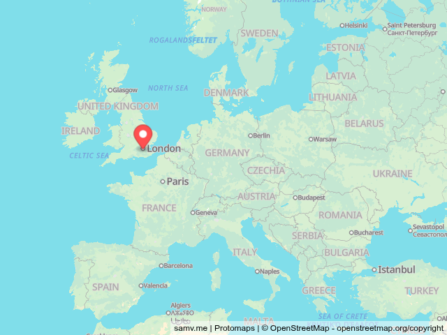

# Static Maps API

Easily show a map of anywhere in the world anywhere you can display an image. This API is completely free to use, with options to customise the location, size, zoom, and colour theme of the map as well as letting you place a custom marker.

This was built with TypeScript, with [Express](https://expressjs.com/) as the web framework, [Protomaps](https://protomaps.com/) for map tiles, [MapLibre GL JS](https://maplibre.org/maplibre-gl-js/docs/) to render the map, and [Playwright](https://playwright.dev/) to take a screenshot of the map to provide to the user.

## API endpoint documentation

The API is available at `/screenshot` with the following parameters:

* `width`: Width of the map in pixels. Default: `640`
* `height`: Height of the map in pixels. Default: `480`
* `lon`: Longitude coordinate the map should be centred on. Default: `0`
* `lat`: Latitude coordinate the map should be centred on. Default: `0`
* `zoom`: Zoom level of the map from 1-22 (with 1 being the most zoomed out). Default: `1`
* `theme`: The colour theme of the map, can be either `light` or `dark`. Default: `light`
* `markerLon`: Longitude coordinate of the marker. If you exclude this option there will be no marker on the map.
* `markerLat`: Latitude coordinate of the marker.
* `markerColor`: Colour of the marker as a hex code (excluding the `#`). Default: `ff5050`